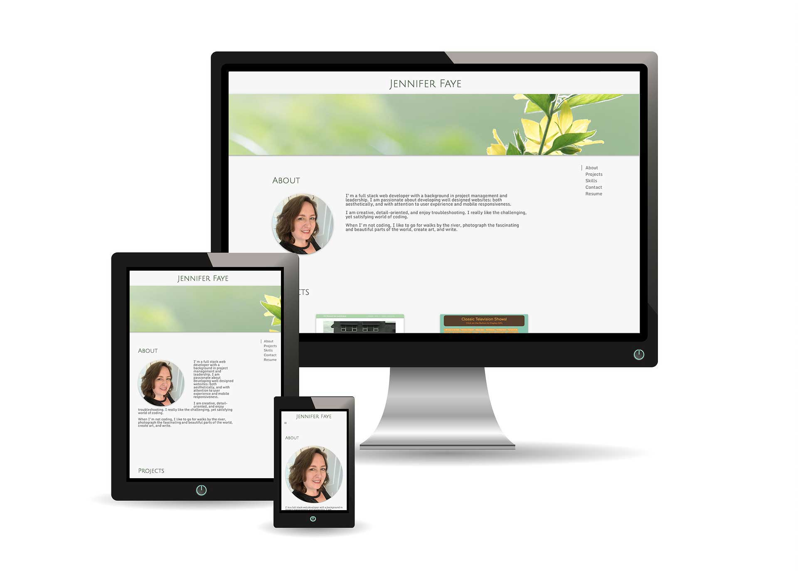

# Jennifer Faye Portfolio

A mobile responsive portfolio designed with Materialize.  

[Jennifer Faye's Portfolio](https://jennifer0101.github.io/Jennifer-Faye-Portfolio/)

## Description

A website displaying the work of Jennifer Faye, a full stack web developer. Using Materialize's Scrollspy, items are clicked on the navigation menu on the right side of the page and the website scrolls down to the corresponding area. 

Projects are displayed in Materialize cards and can be opened to reveal more information and links to the apps and repositories. 

This project has a mobile responsive design and intuitive user interface.

## Screenshots

## Technologies

* HTML5
* CSS3
* Materialize 1.0.0

## Status
Project is: finsihed and published. Adding new projects as they are completed. 

## Contact
Created by [@jennifer0101](https://www.fayecreative.com) - feel free to contact me!