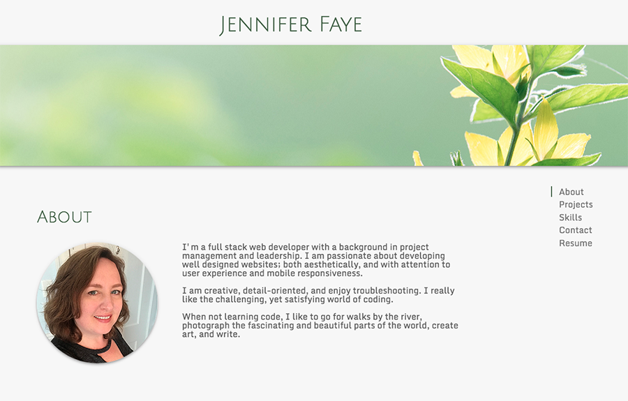
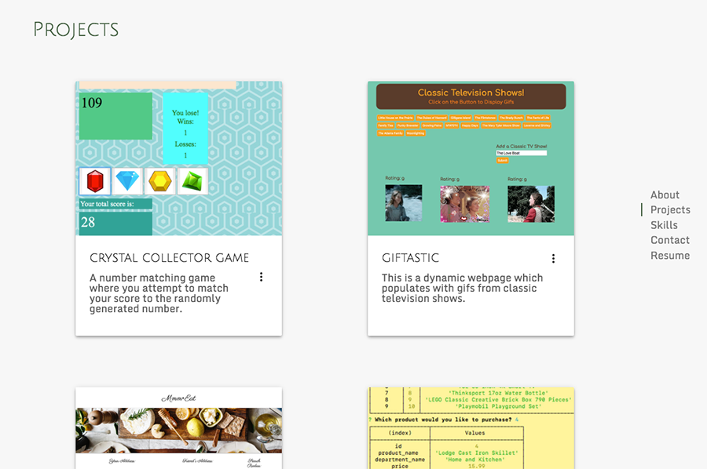
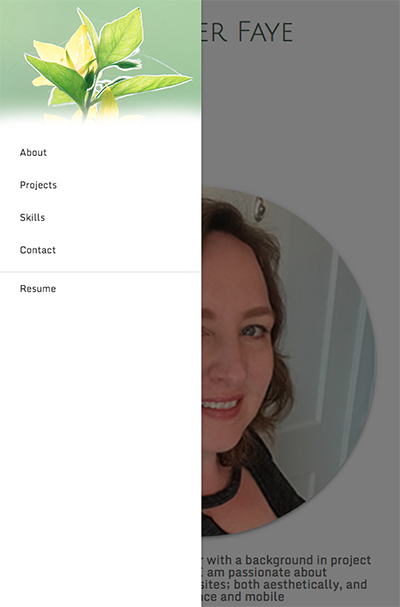

# Jennifer Faye Portfolio

A mobile responsive portfolio designed with Materialize.  

<https://jennifer0101.github.io/Jennifer-Faye-Portfolio/>

## Description

Displays the work of a web developer. Using Materialize Scrollspy, items are clicked on the navigation menu on the right side of the page and the website scrolls down the corresponding area. 

Projects are displayed in Materialize cards and can be opened to reveal more information and links to the projects and repositories. 

This project has a mobile responsive design and intuitive user interface.

## Built With

* HTML5
* CSS3
* Materialize

